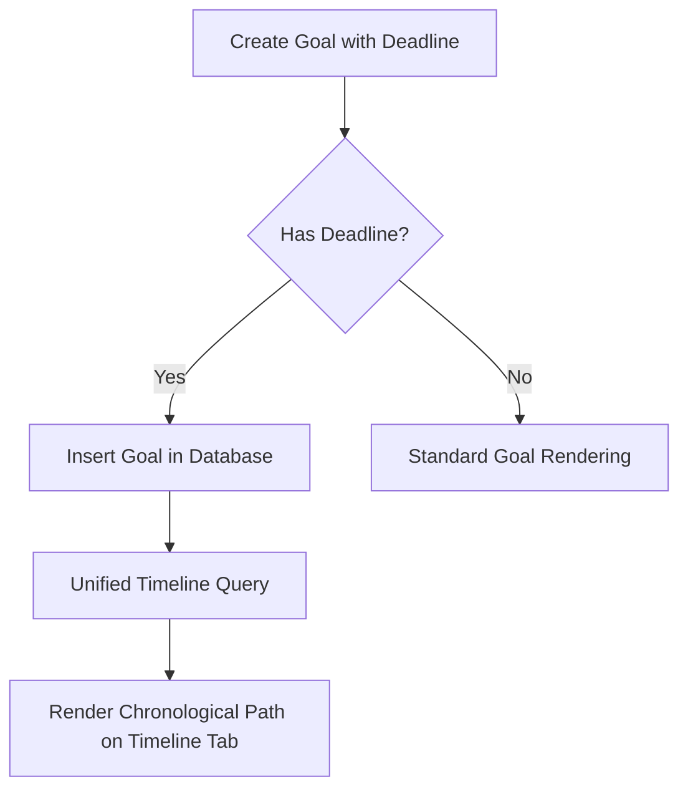

# Polaris Master System Design Blueprint

This document acts as the overall architectural blueprint for the Polaris application ecosystem, detailing how independent goals, Google Calendar integration, Timeline synchronization, and Goal-Setting algorithms are structured.

---

## 1. Spatial Navigation: Constellation Zoom-Out vs. Zoom-In

To completely resolve the disjointed feel, we establish a clean, visual relationship between the **Constellation Map** and your **actionable lists**:

### A. Zoomed-Out View: The Constellation Map
- **The Concept:** Your spatial Starfield of Node Stars (*Career*, *Academic*, *Self*, and their subnodes). This is your high-level identity compass.
- **The Interaction:** Clicking any subnode on the map (e.g., clicking the "Survey Paper" star) triggers a camera focus. It automatically filters your **Goals** and **Timeline** lists below to display *only* the actionable targets and milestones linked to that specific subnode.

### B. Zoomed-In View: Goals & Timeline
- **The Concept:** Your tactical execution deck. Daily, Weekly, and Monthly targets with deadlines mapped out chronologically to reveal your active path.

---

## 2. Identity Integration: Campaign vs. Side Quests

To reflect your true multifaceted identity, Polaris separates goals into two distinct gameplay mechanics:

### A. Main Campaign Goals (Constellations)
- **Focus:** Your core academic/career milestones (MSc Europe, research papers, KiCad PCB validation).
- **Structure:** Hierarchical parent-linked targets (Daily $\rightarrow$ Weekly $\rightarrow$ Monthly) to ensure long-term focus.

### B. Side Quests (Curiosity & Soul)
- **Focus:** Stands as the essential part of your identity—sketching, cooking, learning languages, reading fiction, fitness milestones, or spontaneous creative outlets.
- **Structure:** Standalone, flexible "Side Quests" that do not require any parent linkage. Displayed in a dedicated, gamified **Side Quests Guild** panel with unique compass badges, rewarding you for feeding your curiosity and soul.

---

## 3. "Whispering" Context Layers (Context without Clutter)

To keep your dashboard sleek and minimalist without losing the vital emotional/strategic context of your goals:

### The Layout:
1. **The Card Face:** Minimalist and clean—showing only the goal title, progress metrics, and deadline.
2. **The "Whispering" Context Drawer:** A small, elegant "Info" icon is added to each card. Clicking it smoothly expands a glassmorphic accordion/drawer revealing your custom **Why-Now Context, Guiding Quotes, or Creative Descriptions**. It keeps your emotional anchors just one click away without cluttering your daily view.

---

## 4. Ergonomic Optimization: Merging Music Player into Pomodoro Timer

To protect valuable screen real estate and simplify the workspace, we will completely eliminate the heavy, floating `MusicPlayer` widget and merge its core audio functionality directly into the **Pomodoro Timer**:

### The Integrated Design:
1. **The Floating Widget Removal:** The standalone `MusicPlayer.jsx` widget is removed from the main HUD / Dashboard layout, reclaiming valuable screen space.
2. **Subtle Audio Controls in Pomodoro:** A small, elegant Play/Pause toggle button will be integrated into the footer of the `PomodoroTimer` widget.
3. **Ambient Focus Selection:** A subtle dropdown or cycling button will allow you to select a focus soundtrack (e.g., Lofi, Rain, White Noise, Space Ambient) that plays directly in sync with your focus sessions.
4. **Auto-Pause on Complete:** When the Pomodoro timer ends and the chime plays, the ambient music will automatically fade out or pause, signaling your break interval.

---

## 5. Rebuilt Pomodoro I/O System (Ground-Up Overhaul)

To solve the fragile nature of the current I/O selector, we will rebuild the I/O logging mechanic from the ground up:

### The Rebuilt Specifications:
1. **Accrued Logging (No Lost Work):** Instead of only saving when the timer successfully hits `0`, the Pomodoro widget will calculate accrued minutes in real-time. A prominent, tactile **"Log Accrued Minutes"** button is added, allowing you to save your progress (e.g., 18 mins out of 25) if you pause or stop early.
2. **Dynamic Category Dropdown:** We replace the custom text comment box with a select dropdown that dynamically loads the official categories used by the `IOBalanceBar`:
   - **Inputs:** `reading`, `lecture`, `video`, `course`, `scrolling`, `other`
   - **Outputs:** `writing`, `building`, `designing`, `coding`, `creating`, `practicing`, `other`
   - This ensures 100% data sync and seamless rendering on your I/O Bar.
3. **Glassmorphic Sliding Toggle:** We will replace the standard text buttons with a highly tactile glassmorphic sliding pill toggle to switch between Input and Output, styled with glowing borders (Amber for Input, Emerald for Output).

---

## 6. Google Calendar Integration & Workload Estimator

To manage your daily workload and prevent burnout, we will implement a client-side Google Calendar integration:

### The Workflow:
1. **The "Sync to GCal" Button:** Added to any Daily Goal or Task.
2. **Dynamic Quick Add:** Clicking it opens a Google Calendar event page with pre-populated details:
   - **Title:** Polaris: `[Goal Title]`
   - **Timestamp:** Calculated based on the goal's target duration (e.g., `2 hours`).
   - **Description:** Pre-filled with your goal metrics, current progress, and parent linkages.
3. **Google API (gapi) Sync (Alternative):** We can implement an optional `@react-oauth/google` sign-in button in settings, allowing Polaris to directly inject events into a custom "Polaris Workload" calendar folder in the background.

---

## 7. Unified Goal-Timeline Synchronization

Currently, your Timeline/Milestones are hardcoded or fetched separately. We will unify them:



### The Implementation:
1. **Deadline Field:** We will add a `deadline` (Date) field to the `goals` creation modal.
2. **Timeline Compilation:** The **Timeline/Milestones** tab will fetch both:
   - Hardcoded master milestones (from the `milestones` table).
   - Any goals (Daily, Weekly, Monthly, Quarterly) that have a `deadline` set.
3. **The Chronological Path:** They are sorted chronologically and rendered as a beautiful glowing cosmic path, allowing you to see your entire roadmap at a glance.

---

## 8. Goal-Setting Algorithms: Comparison & Selection

The AI Goal Alignment Auditor will use a tailored **Star-Map Hybrid Algorithm** (detailed below) but can compare standard models:

| Algorithm | Focus | Pros | Cons |
| :--- | :--- | :--- | :--- |
| **SMART** | Specific, Measurable, Achievable, Relevant, Time-bound | Clear metrics, easy database schema, great for time-boxing. | Feels clinical, ignores passion/intrinsic ADHD drive. |
| **HARD** | Heartfelt, Animated, Required, Difficult | Taps into deep intrinsic motivation, highly visual. | Harder to quantify into strict numeric tracking. |
| **FAST** | Frequently discussed, Ambitious, Specific, Transparent | Fast pivots, ambitious targets keep things exciting. | Easy to lose track of consistency. |

### The Chosen Polaris Algorithm: The "Star-Map Hybrid" (SMART + HARD)
We will combine **HARD** (for long-term vision) with **SMART** (for daily actions):
- **HARD for 5-Year & Yearly Goals:** AI audits these based on emotional connection (*Heartfelt*), clarity of vision (*Animated*), and urgency (*Required*).
- **SMART for Monthly, Weekly & Daily Goals:** AI audits these strictly on *Measurability* (targets and units) and *Time-boundedness* (deadlines).

---

## 9. Heartfelt & Constructive AI Goal Auditor Prompt

The AI Goal Auditor in the `GoalsPanel` will be configured as follows:

```markdown
"You are a wise, warm, and highly analytical personal strategist. Analyze the user's active goals, deadline dates, and parent-child linkages. 

Tone Guidelines:
- Heartfelt & Empathetic: Sincerely appreciate their effort, understand their personal context, and celebrate well-structured links.
- Highly Structured: Deliver advice in clear, scannable bullet points (categorized into Alignment, Gaps, and Overcomplications).
- Constructive Criticism: Do not hesitate to call out weak or vague goals (e.g., 'Do some research' is too vague — suggest replacing with a SMART alternative like 'Read 2 papers'). Point out 'floating' goals that have no parents or children.

Audit their goal-set using the Star-Map Algorithm (SMART for daily/weekly, HARD for yearly/5-year)."
```
